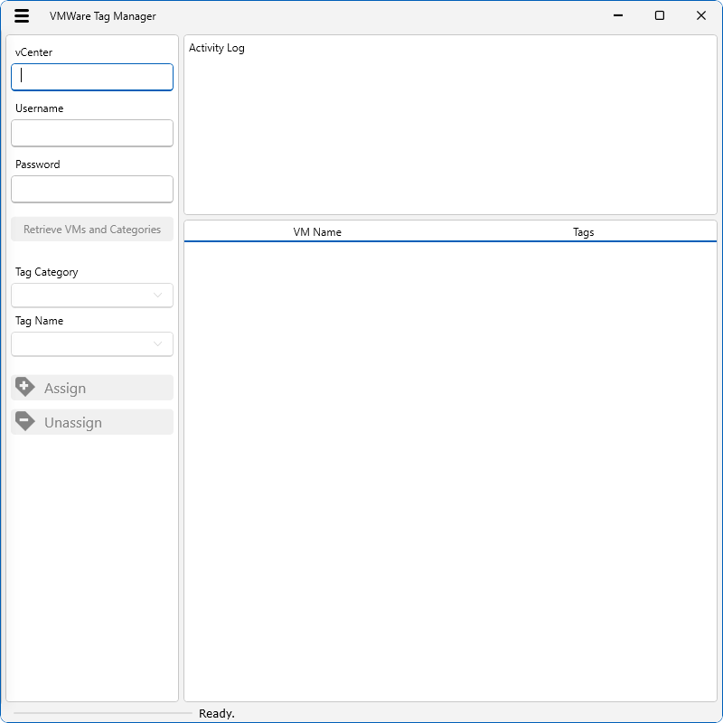

# VMWare Bulk Tagging Tool

This tool was built to provide a quick way to tag and untag multiple VMs without having to manually navigate through the vCenter and individually tag or untag them.
### This repo includes

- XaML files

    UI Definitions for the main window, and Common Control Templates from the [PoSH GUI Template](https://github.com/nct911/PoSH-GUI-Template)
- PowerShell Script

    Program Code, which includes all the standard functions from the [PoSH GUI Template](https://github.com/nct911/PoSH-GUI-Template)
- Visual Studio Project

    Setup so that you can open it and go directly to the WPF Designer view to edit the Window Contents and layout. This project is for Visual Studio 2022, it's not guaranteed to work with older versions. If you have an older version, though, you can follow this procedure to create project you can use:

1. Create a new WPF project named **PoSH_GUI_Template**
2. Use the **Solution Explorer** to **Add Existing Item...** to your project and add the **ControlTemplates.XaML**
3. Replace **App.XaML** with the one from this project.
4. Replace **MainWindow.XaML** with the one from this project.

### This requires

- Windows PowerShell
- [VMWare PowerCLI](https://developer.vmware.com/powercli) for PowerShell.

### Screenshot

